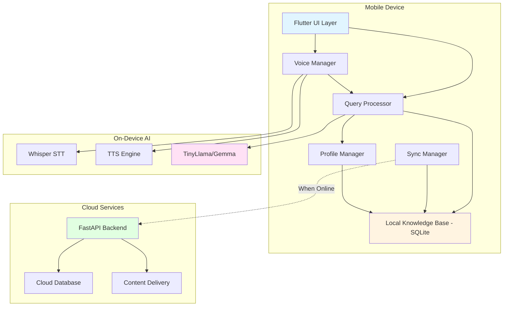

# Design Document: GramSaathi AI

## Overview

GramSaathi AI is an offline-first, voice-enabled AI assistant architected for resource-constrained mobile devices in rural India. The system employs a layered architecture with on-device AI processing, local-first data storage, and opportunistic cloud synchronization to provide reliable access to critical information without continuous internet connectivity.

The design prioritizes:
- **Offline-first operation**: All core functionality works without internet
- **Resource efficiency**: Optimized for devices with 2GB RAM and limited storage
- **Voice-first interaction**: Natural language processing in regional languages
- **Smart synchronization**: Intelligent data sync when connectivity is available
- **Privacy by design**: On-device processing with minimal data transmission

## Architecture

### System Architecture



### Component Layers

1. **Presentation Layer** (Flutter)
   - Voice interface with waveform visualization
   - Text input fallback
   - Menu-driven navigation for low-literacy users
   - Multi-language UI rendering

2. **Application Layer**
   - Voice Manager: Orchestrates STT/TTS operations
   - Query Processor: Interprets queries and generates responses
   - Profile Manager: Handles user preferences and personalization
   - Sync Manager: Manages cloud synchronization

3. **AI Layer** (On-Device)
   - Whisper: Speech-to-text conversion
   - TinyLlama/Gemma: Natural language understanding and generation
   - TTS Engine: Text-to-speech synthesis
   - Language Engine: Regional language processing

4. **Data Layer**
   - SQLite: Local knowledge base and user data
   - Encrypted storage for sensitive information
   - Indexed for fast query retrieval

5. **Cloud Layer** (Optional)
   - FastAPI: REST API for data synchronization
   - Cloud Database: Centralized knowledge base
   - CDN: Model and content distribution

## Components and Interfaces

### 1. Voice Manager

**Responsibilities:**
- Capture audio input from device microphone
- Convert speech to text using Whisper
- Convert text responses to speech
- Manage audio playback and recording states

**Interface:**
```typescript
interface VoiceManager {
  // Start listening for voice input
  startListening(language: string): Promise<void>
  
  // Stop listening and process captured audio
  stopListening(): Promise<string>
  
  // Convert text to speech and play
  speak(text: string, language: string): Promise<void>
  
  // Stop current speech playback
  stopSpeaking(): void
  
  // Check if voice input is available
  isVoiceAvailable(): boolean
}
```

**Key Design Decisions:**
- Use Whisper tiny model (39MB) for optimal size/accuracy tradeoff
- Implement voice activity detection to auto-stop recording
- Cache TTS output for common phrases to reduce latency
- Support streaming audio processing for faster response

### 2. Query Processor

**Responsibilities:**
- Parse and understand user queries
- Retrieve relevant information from Knowledge Base
- Generate contextual responses using LLM
- Apply personalization based on user profile

**Interface:**
```typescript
interface QueryProcessor {
  // Process a user query and generate response
  processQuery(query: string, userId: string): Promise<QueryResponse>
  
  // Get query suggestions based on context
  getSuggestions(context: UserContext): Promise<string[]>
  
  // Validate query against supported domains
  validateQuery(query: string): ValidationResult
}

interface QueryResponse {
  text: string
  confidence: number
  sources: string[]
  relatedQueries: string[]
  requiresUpdate: boolean
}
```

**Key Design Decisions:**
- Use RAG (Retrieval-Augmented Generation) pattern: retrieve from KB, then generate with LLM
- Implement query classification to route to specialized handlers (farming, schemes, health)
- Cache frequent query patterns to reduce LLM invocations
- Use semantic search with embeddings for KB retrieval

### 3. Local Knowledge Base

**Responsibilities:**
- Store structured and unstructured knowledge
- Provide fast query and retrieval
- Manage data versioning and updates
- Compress data to minimize storage

**Schema Design:**
```sql
-- Core knowledge articles
CREATE TABLE knowledge_articles (
  id INTEGER PRIMARY KEY,
  category TEXT NOT NULL,
  subcategory TEXT,
  title TEXT NOT NULL,
  content TEXT NOT NULL,
  language TEXT NOT NULL,
  version INTEGER NOT NULL,
  last_updated TIMESTAMP,
  embedding BLOB,
  INDEX idx_category (category, subcategory),
  INDEX idx_language (language)
);

-- Government schemes
CREATE TABLE government_schemes (
  id INTEGER PRIMARY KEY,
  scheme_name TEXT NOT NULL,
  description TEXT NOT NULL,
  eligibility_criteria TEXT NOT NULL,
  required_documents TEXT,
  application_process TEXT,
  state TEXT,
  category TEXT NOT NULL,
  language TEXT NOT NULL,
  version INTEGER NOT NULL,
  INDEX idx_category (category),
  INDEX idx_state (state)
);

-- Weather data
CREATE TABLE weather_data (
  id INTEGER PRIMARY KEY,
  location TEXT NOT NULL,
  date DATE NOT NULL,
  temperature_min REAL,
  temperature_max REAL,
  rainfall REAL,
  humidity REAL,
  forecast TEXT,
  alert_level TEXT,
  last_updated TIMESTAMP,
  INDEX idx_location_date (location, date)
);

-- Local services
CREATE TABLE local_services (
  id INTEGER PRIMARY KEY,
  service_type TEXT NOT NULL,
  name TEXT NOT NULL,
  address TEXT,
  contact TEXT,
  latitude REAL,
  longitude REAL,
  district TEXT NOT NULL,
  state TEXT NOT NULL,
  INDEX idx_location (district, state),
  INDEX idx_type (service_type)
);

-- User profile
CREATE TABLE user_profile (
  user_id TEXT PRIMARY KEY,
  name TEXT,
  location TEXT NOT NULL,
  district TEXT,
  state TEXT,
  occupation TEXT,
  land_size REAL,
  crop_types TEXT,
  preferred_language TEXT NOT NULL,
  created_at TIMESTAMP,
  updated_at TIMESTAMP
);

-- Query history
CREATE TABLE query_history (
  id INTEGER PRIMARY KEY AUTOINCREMENT,
  user_id TEXT NOT NULL,
  query TEXT NOT NULL,
  response TEXT NOT NULL,
  language TEXT NOT NULL,
  timestamp TIMESTAMP NOT NULL,
  is_favorite BOOLEAN DEFAULT 0,
  INDEX idx_user_time (user_id, timestamp),
  INDEX idx_favorite (user_id, is_favorite)
);
```

**Key Design Decisions:**
- Use FTS5 (Full-Text Search) for efficient text search
- Store embeddings as BLOBs for semantic search
- Implement data partitioning by language to reduce memory footprint
- Use PRAGMA optimizations for mobile (WAL mode, memory-mapped I/O)

### 4. Sync Manager

**Responsibilities:**
- Detect internet connectivity
- Synchronize knowledge base updates
- Upload anonymized usage analytics
- Manage sync conflicts and versioning

**Interface:**
```typescript
interface SyncManager {
  // Check if sync is needed
  shouldSync(): Promise<boolean>
  
  // Perform full synchronization
  sync(): Promise<SyncResult>
  
  // Download specific content categories
  syncCategory(category: string): Promise<void>
  
  // Upload analytics data
  uploadAnalytics(): Promise<void>
  
  // Get sync status
  getSyncStatus(): SyncStatus
}

interface SyncResult {
  success: boolean
  itemsDownloaded: number
  itemsUploaded: number
  errors: string[]
  lastSyncTime: Date
}

interface SyncStatus {
  isOnline: boolean
  isSyncing: boolean
  lastSyncTime: Date | null
  pendingUpdates: number
}
```

**Key Design Decisions:**
- Use delta sync to transfer only changed data
- Implement priority-based sync (critical updates first)
- Use exponential backoff for retry logic
- Compress data transfers using gzip
- Support resumable downloads for large model updates

### 5. Scheme Matcher

**Responsibilities:**
- Match user profiles with eligible government schemes
- Rank schemes by relevance
- Provide eligibility explanations
- Track scheme application status

**Interface:**
```typescript
interface SchemeMatcher {
  // Find schemes matching user profile
  matchSchemes(userId: string): Promise<SchemeMatch[]>
  
  // Check eligibility for specific scheme
  checkEligibility(userId: string, schemeId: string): Promise<EligibilityResult>
  
  // Get required documents for scheme
  getRequiredDocuments(schemeId: string): Promise<Document[]>
}

interface SchemeMatch {
  scheme: GovernmentScheme
  relevanceScore: number
  eligibilityStatus: 'eligible' | 'partially_eligible' | 'not_eligible'
  missingCriteria: string[]
}

interface EligibilityResult {
  isEligible: boolean
  matchedCriteria: string[]
  missingCriteria: string[]
  explanation: string
}
```

**Key Design Decisions:**
- Use rule-based matching for deterministic eligibility
- Implement fuzzy matching for partial eligibility
- Cache eligibility results per user profile
- Support multi-criteria matching (AND/OR logic)

### 6. Language Engine

**Responsibilities:**
- Detect input language
- Translate between languages if needed
- Handle regional language nuances
- Manage language model loading

**Interface:**
```typescript
interface LanguageEngine {
  // Detect language from text
  detectLanguage(text: string): Promise<string>
  
  // Translate text between languages
  translate(text: string, fromLang: string, toLang: string): Promise<string>
  
  // Load language-specific models
  loadLanguageModel(language: string): Promise<void>
  
  // Get supported languages
  getSupportedLanguages(): string[]
}
```

**Key Design Decisions:**
- Use language-specific tokenizers for better accuracy
- Implement lazy loading of language models
- Support code-mixing (Hinglish, Tanglish)
- Use transliteration for regional script support

## Data Models

### Core Data Structures

```typescript
// User Profile
interface UserProfile {
  userId: string
  name?: string
  location: Location
  occupation: Occupation
  landSize?: number  // in acres
  cropTypes?: string[]
  preferredLanguage: Language
  familySize?: number
  incomeCategory?: IncomeCategory
  createdAt: Date
  updatedAt: Date
}

interface Location {
  district: string
  state: string
  pincode?: string
  latitude?: number
  longitude?: number
}

enum Occupation {
  FARMER = 'farmer',
  AGRICULTURAL_LABORER = 'agricultural_laborer',
  SMALL_BUSINESS = 'small_business',
  STUDENT = 'student',
  HOMEMAKER = 'homemaker',
  OTHER = 'other'
}

enum Language {
  HINDI = 'hi',
  TAMIL = 'ta',
  TELUGU = 'te',
  MARATHI = 'mr',
  BENGALI = 'bn',
  KANNADA = 'kn',
  GUJARATI = 'gu',
  MALAYALAM = 'ml'
}

enum IncomeCategory {
  BPL = 'below_poverty_line',
  APL = 'above_poverty_line',
  MARGINAL = 'marginal_farmer',
  SMALL = 'small_farmer',
  MEDIUM = 'medium_farmer'
}

// Knowledge Article
interface KnowledgeArticle {
  id: string
  category: KnowledgeCategory
  subcategory?: string
  title: string
  content: string
  language: Language
  version: number
  lastUpdated: Date
  embedding?: number[]  // For semantic search
  tags: string[]
}

enum KnowledgeCategory {
  FARMING = 'farming',
  GOVERNMENT_SCHEMES = 'government_schemes',
  HEALTHCARE = 'healthcare',
  WEATHER = 'weather',
  LOCAL_SERVICES = 'local_services',
  EDUCATION = 'education',
  FINANCIAL_LITERACY = 'financial_literacy'
}

// Government Scheme
interface GovernmentScheme {
  id: string
  schemeName: string
  description: string
  eligibilityCriteria: EligibilityCriteria
  requiredDocuments: Document[]
  applicationProcess: string
  benefits: string
  state?: string  // null for central schemes
  category: SchemeCategory
  language: Language
  version: number
  officialLink?: string
}

interface EligibilityCriteria {
  minAge?: number
  maxAge?: number
  occupation?: Occupation[]
  incomeCategory?: IncomeCategory[]
  landSize?: { min?: number; max?: number }
  gender?: 'male' | 'female' | 'other' | 'any'
  customCriteria?: Record<string, any>
}

enum SchemeCategory {
  AGRICULTURE = 'agriculture',
  EDUCATION = 'education',
  HEALTHCARE = 'healthcare',
  HOUSING = 'housing',
  EMPLOYMENT = 'employment',
  SOCIAL_WELFARE = 'social_welfare',
  FINANCIAL = 'financial'
}

// Query and Response
interface Query {
  id: string
  userId: string
  text: string
  language: Language
  timestamp: Date
  context?: QueryContext
}

interface QueryContext {
  previousQueries: string[]
  userProfile: UserProfile
  location: Location
  sessionId: string
}

interface Response {
  queryId: string
  text: string
  confidence: number
  sources: Source[]
  relatedQueries: string[]
  requiresUpdate: boolean  // True if data is stale
  generatedAt: Date
}

interface Source {
  type: 'knowledge_base' | 'scheme' | 'weather' | 'service'
  id: string
  title: string
  relevance: number
}

// Weather Data
interface WeatherData {
  location: string
  date: Date
  temperatureMin: number
  temperatureMax: number
  rainfall: number
  humidity: number
  forecast: string
  alertLevel: 'none' | 'low' | 'medium' | 'high' | 'severe'
  lastUpdated: Date
}

// Local Service
interface LocalService {
  id: string
  serviceType: ServiceType
  name: string
  address: string
  contact?: string
  location: Location
  operatingHours?: string
  description?: string
}

enum ServiceType {
  VETERINARY = 'veterinary',
  AGRICULTURAL_SUPPLY = 'agricultural_supply',
  HEALTHCARE = 'healthcare',
  GOVERNMENT_OFFICE = 'government_office',
  BANK = 'bank',
  POST_OFFICE = 'post_office',
  EDUCATION = 'education',
  MARKET = 'market'
}

// Sync Metadata
interface SyncMetadata {
  lastSyncTime: Date | null
  pendingUploads: number
  pendingDownloads: number
  syncVersion: number
  conflicts: SyncConflict[]
}

interface SyncConflict {
  resourceType: string
  resourceId: string
  localVersion: number
  remoteVersion: number
  resolution: 'pending' | 'local_wins' | 'remote_wins'
}
```

## Correctness Properties

*A property is a characteristic or behavior that should hold true across all valid executions of a system—essentially, a formal statement about what the system should do. Properties serve as the bridge between human-readable specifications and machine-verifiable correctness guarantees.*


### Property Reflection

After analyzing all acceptance criteria, I've identified the following redundancies and consolidations:

**Redundant Properties:**
- 1.4 and 2.4 both test language consistency (output language matches input language) - consolidate into one property
- Multiple sync properties (3.4, 4.3, 5.2, 7.3, 10.3) all test that sync downloads updated data - consolidate into one comprehensive sync property
- Multiple response completeness properties (3.1, 4.2, 8.1, 10.2) test that responses contain required fields - can be consolidated into category-specific properties

**Properties to Combine:**
- Sync behavior properties (5.1, 5.2, 5.3, 5.4, 5.5, 5.6) can be grouped into fewer comprehensive properties
- Storage and encryption properties (9.2, 13.1) both test encryption - consolidate
- Error handling properties (14.1, 14.2, 14.3, 14.4, 14.5) can be consolidated into fewer comprehensive error handling properties

After reflection, the following properties provide unique validation value:

### Core Properties

**Property 1: Offline Voice Processing**
*For any* voice query in a supported language, when the device is offline, the system should successfully convert speech to text, process the query using local resources, and generate a response within 5 seconds.
**Validates: Requirements 1.1, 1.2, 1.3, 1.5**

**Property 2: Language Consistency**
*For any* query in a supported language, the response should be provided in the same language as the input query, both in text and audio format.
**Validates: Requirements 1.4, 2.4, 15.4**

**Property 3: Language Preference Persistence**
*For any* language selection by a user, storing the preference and then retrieving the user profile should return the same language preference.
**Validates: Requirements 2.2**

**Property 4: Automatic Language Detection**
*For any* text input in a supported language when no language preference is set, the system should correctly identify the input language with at least 90% accuracy.
**Validates: Requirements 2.3**

**Property 5: Crop Query Completeness**
*For any* crop cultivation query, the response should include planting seasons, soil requirements, and irrigation schedules.
**Validates: Requirements 3.1**

**Property 6: Location-Based Personalization**
*For any* user profile with location and crop type, farming advice should be specific to that region's climate, soil, and growing conditions.
**Validates: Requirements 3.2**

**Property 7: Pest Management Response Completeness**
*For any* pest management query, the response should include both organic and chemical treatment options along with safety guidelines.
**Validates: Requirements 3.3**

**Property 8: Scheme Matching Completeness**
*For any* user profile, the scheme matcher should return all government schemes where the user meets the eligibility criteria.
**Validates: Requirements 4.1**

**Property 9: Scheme Information Completeness**
*For any* government scheme displayed to a user, the information should include scheme name, eligibility criteria, required documents, and application process.
**Validates: Requirements 4.2**

**Property 10: Scheme Filtering and Ranking**
*For any* scheme category query, all returned schemes should belong to that category and be ranked by relevance score in descending order.
**Validates: Requirements 4.4**

**Property 11: Automatic Sync Trigger**
*For any* connectivity state change from offline to online, the sync manager should automatically initiate synchronization within 10 seconds.
**Validates: Requirements 5.1**

**Property 12: Comprehensive Data Sync**
*For any* successful synchronization, the system should download all available updates for knowledge base content, language models, scheme information, weather data, and service directories relevant to the user's location.
**Validates: Requirements 3.4, 4.3, 5.2, 7.3, 10.3**

**Property 13: Analytics Upload with Anonymization**
*For any* analytics data uploaded during synchronization, all user-identifiable information (name, exact location, device ID) should be removed or hashed.
**Validates: Requirements 5.3, 13.2**

**Property 14: Sync Retry with Exponential Backoff**
*For any* failed synchronization attempt, the system should retry up to 3 times with exponentially increasing delays (e.g., 2s, 4s, 8s).
**Validates: Requirements 5.4**

**Property 15: Sync Notification**
*For any* completed synchronization that downloaded new content, the user should receive a notification listing the updated content categories.
**Validates: Requirements 5.5**

**Property 16: Concurrent Operation During Sync**
*For any* query submitted while synchronization is in progress, the system should process it using local data without blocking or degraded performance.
**Validates: Requirements 5.6**

**Property 17: Query Performance**
*For any* knowledge base query, the system should retrieve and return results within 500 milliseconds.
**Validates: Requirements 6.2**

**Property 18: Selective Sync Activation**
*For any* knowledge base that exceeds 500MB in size, the sync manager should implement selective synchronization, downloading only content relevant to the user's location and stated interests.
**Validates: Requirements 6.3**

**Property 19: Data Compression**
*For any* data stored in the knowledge base, the storage size should be at least 30% smaller than the uncompressed equivalent.
**Validates: Requirements 6.4**

**Property 20: Weather Forecast Completeness**
*For any* weather query, the response should include forecast data for 7 consecutive days starting from the current date.
**Validates: Requirements 7.1**

**Property 21: Severe Weather Notifications**
*For any* severe weather alert (level high or severe) matching the user's location, the system should send a proactive notification to the user within 5 minutes of the alert being available locally.
**Validates: Requirements 7.2**

**Property 22: Stale Data Warning**
*For any* weather query when the local weather data is older than 24 hours and the device is offline, the response should include a warning that the data may be outdated.
**Validates: Requirements 7.4**

**Property 23: Health Query Response Completeness**
*For any* health condition query, the response should include symptoms, prevention tips, and guidance on when to seek medical help.
**Validates: Requirements 8.1**

**Property 24: First Aid Step-by-Step Format**
*For any* first aid query, the response should be formatted as numbered step-by-step instructions.
**Validates: Requirements 8.2**

**Property 25: Health Disclaimer Presence**
*For any* health-related response, the text should include a disclaimer stating that the advice does not replace professional medical consultation.
**Validates: Requirements 8.3**

**Property 26: Health Advisory Priority Sync**
*For any* synchronization that includes both health advisory updates and other content updates, health advisories should be downloaded before other content types.
**Validates: Requirements 8.5**

**Property 27: Profile Data Encryption**
*For any* user profile data stored locally, the data should be encrypted using AES-256 encryption, verifiable by attempting to read the raw storage file.
**Validates: Requirements 9.2, 13.1**

**Property 28: Profile-Based Personalization**
*For any* two identical queries from users with different profiles (different locations or occupations), the responses should differ in at least one aspect reflecting the profile differences.
**Validates: Requirements 9.3**

**Property 29: Immediate Profile Update Effect**
*For any* user profile update followed immediately by a query, the query response should reflect the updated profile data.
**Validates: Requirements 9.4**

**Property 30: Location-Based Service Filtering**
*For any* local services query, all returned services should be within 50km of the user's location or be the closest available services if none exist within 50km.
**Validates: Requirements 10.1**

**Property 31: Service Information Completeness**
*For any* local service displayed, the information should include name, address, contact number (if available), and calculated distance from the user.
**Validates: Requirements 10.2**

**Property 32: Missing Service Data Handling**
*For any* service query where no services are found in the user's location, the response should inform the user and suggest the nearest alternative location with available services.
**Validates: Requirements 10.5**

**Property 33: Query History Persistence**
*For any* completed query-response pair, storing it in history and then retrieving the history should return an entry containing the same query text and response text.
**Validates: Requirements 11.1**

**Property 34: History Display Limit**
*For any* query history view, the system should display at most the 100 most recent queries, ordered by timestamp descending.
**Validates: Requirements 11.2**

**Property 35: Favorites Persistence**
*For any* query response marked as favorite, it should appear in the favorites list and remain there even after the query history is cleared.
**Validates: Requirements 11.3**

**Property 36: History Search Filtering**
*For any* keyword search in query history, all returned results should contain the keyword in either the query text or response text.
**Validates: Requirements 11.4**

**Property 37: History Cleanup with Favorites Preservation**
*For any* automatic history cleanup triggered by low storage, all queries older than 90 days should be removed except those marked as favorites.
**Validates: Requirements 11.5**

**Property 38: Background Model Updates**
*For any* available model update when the device is online and not in low-power mode, the sync manager should download the update in the background without blocking user interactions.
**Validates: Requirements 12.3**

**Property 39: Model Update Application on Restart**
*For any* downloaded model update, the new model should be used for query processing after the next app restart, verifiable by checking the model version.
**Validates: Requirements 12.4**

**Property 40: Low Storage Warning and Pause**
*For any* device state where available storage falls below 100MB, the system should display a warning to the user and pause all non-essential downloads.
**Validates: Requirements 12.5**

**Property 41: Voice Recording Privacy**
*For any* voice query processed by the system, the audio recording should not be transmitted to any network endpoint unless the user has explicitly enabled voice data sharing in settings.
**Validates: Requirements 13.4**

**Property 42: On-Device Query Processing**
*For any* query processing operation, no network requests should be made to external services, verifiable by monitoring network activity during query processing.
**Validates: Requirements 13.5**

**Property 43: Data Deletion Completeness**
*For any* user data deletion request, all local user data (profile, history, favorites) should be removed, and a deletion request should be sent to cloud services when connectivity is available.
**Validates: Requirements 13.3**

**Property 44: Speech Recognition Failure Recovery**
*For any* speech recognition failure, the system should prompt the user to retry and display a text input option as an alternative.
**Validates: Requirements 14.1**

**Property 45: No Results Graceful Handling**
*For any* query where no relevant information is found in the knowledge base, the system should return the closest matching results (if any) and suggest query refinements.
**Validates: Requirements 14.2**

**Property 46: Component Failure Isolation**
*For any* component failure (e.g., TTS engine crash), the error should be logged locally, and the system should continue operating with remaining functional components.
**Validates: Requirements 14.3**

**Property 47: Repeated Sync Failure Handling**
*For any* synchronization that fails 3 consecutive times, the system should notify the user of the sync failure and continue operating normally with local data.
**Validates: Requirements 14.4**

**Property 48: Low Resource Feature Degradation**
*For any* device state where available RAM falls below 200MB, the system should disable non-essential features (e.g., voice output, history search) and notify the user.
**Validates: Requirements 14.5**

**Property 49: Language-Specific Keyboard Support**
*For any* supported language selected by the user, the text input interface should provide a keyboard with appropriate character support for that language.
**Validates: Requirements 15.2**

## Error Handling

### Error Categories and Strategies

**1. Voice Input Errors**
- Speech recognition failure: Prompt retry, offer text input fallback
- Microphone permission denied: Show permission request with explanation
- Audio quality too low: Suggest quieter environment, offer text input
- Unsupported language detected: Inform user, suggest supported languages

**2. Query Processing Errors**
- No relevant results found: Return closest matches, suggest query refinements
- Ambiguous query: Ask clarifying questions or show multiple interpretations
- Query too complex: Break down into simpler sub-queries
- Knowledge base query timeout: Return partial results, log performance issue

**3. Synchronization Errors**
- Network timeout: Retry with exponential backoff (3 attempts)
- Server unavailable: Queue for later retry, continue with local data
- Partial sync failure: Complete successful parts, retry failed parts
- Sync conflict: Prefer remote data for knowledge base, local data for user profile

**4. Storage Errors**
- Disk full: Trigger automatic cleanup, warn user, pause downloads
- Database corruption: Attempt repair, fallback to backup, re-download if needed
- Encryption key loss: Cannot recover, require profile recreation
- Write permission denied: Request permission, explain need

**5. Resource Constraint Errors**
- Low memory: Unload non-essential components, disable features temporarily
- Low battery: Reduce background sync frequency, disable voice output
- Slow device: Increase timeout thresholds, reduce animation
- Model loading failure: Fallback to smaller model, inform user of reduced capability

### Error Logging Strategy

All errors are logged locally with:
- Timestamp
- Error category and code
- Component that failed
- User context (anonymized)
- Device state (memory, storage, connectivity)
- Recovery action taken

Logs are uploaded during sync for system improvement (anonymized).

### Graceful Degradation Hierarchy

1. **Full functionality**: All features available
2. **Voice output disabled**: Text-only responses to save resources
3. **Sync disabled**: Operate entirely offline
4. **Advanced features disabled**: Only basic query processing
5. **Emergency mode**: Menu-driven interface only, no AI processing

## Testing Strategy

### Dual Testing Approach

The GramSaathi AI system requires both unit testing and property-based testing for comprehensive validation:

**Unit Tests** focus on:
- Specific examples of query processing (e.g., "What is the best time to plant rice?")
- Edge cases (empty queries, special characters, very long inputs)
- Integration points (Voice Manager → Query Processor → Knowledge Base)
- Error conditions (network failures, corrupted data, missing permissions)
- UI interactions (button clicks, gesture recognition, screen transitions)

**Property-Based Tests** focus on:
- Universal properties that hold for all inputs (see Correctness Properties section)
- Comprehensive input coverage through randomization
- Invariants that must be maintained (e.g., language consistency, data encryption)
- Round-trip properties (e.g., profile save/load, sync up/down)

### Property-Based Testing Configuration

**Framework Selection:**
- **Dart/Flutter**: Use `test` package with custom property test helpers or `faker` for data generation
- **Python (Backend)**: Use `hypothesis` library
- **TypeScript**: Use `fast-check` library

**Test Configuration:**
- Minimum 100 iterations per property test
- Each test tagged with: **Feature: gramsaathi-ai, Property {N}: {property_text}**
- Seed-based randomization for reproducibility
- Shrinking enabled to find minimal failing cases

**Example Property Test Structure:**
```dart
// Feature: gramsaathi-ai, Property 2: Language Consistency
test('responses match input language', () {
  final languages = [Language.HINDI, Language.TAMIL, Language.TELUGU];
  
  for (var i = 0; i < 100; i++) {
    final language = languages[Random().nextInt(languages.length)];
    final query = generateRandomQuery(language);
    
    final response = queryProcessor.processQuery(query, testUserId);
    
    expect(response.language, equals(language));
    expect(detectLanguage(response.text), equals(language));
  }
});
```

### Test Data Generation

**Generators needed:**
- Random user profiles (various locations, occupations, languages)
- Random queries in multiple languages
- Random knowledge base content
- Random weather data
- Random government schemes
- Random service listings
- Random audio samples for voice testing

### Integration Testing

**Critical Integration Points:**
1. Voice Manager ↔ Query Processor
2. Query Processor ↔ Knowledge Base
3. Sync Manager ↔ Cloud API
4. Profile Manager ↔ Scheme Matcher
5. UI ↔ All backend components

**Integration Test Scenarios:**
- End-to-end voice query flow (speak → process → respond)
- Offline-to-online transition with sync
- Profile update affecting query results
- Scheme matching with various user profiles
- Multi-language query processing

### Performance Testing

**Key Metrics:**
- Speech-to-text latency: < 3 seconds
- Query processing time: < 500ms
- Text-to-speech latency: < 2 seconds
- App startup time: < 5 seconds
- Memory usage: < 500MB during normal operation
- Storage footprint: < 2GB including models

**Load Testing:**
- Rapid consecutive queries (stress test)
- Large knowledge base queries (10,000+ entries)
- Concurrent sync and query processing
- Extended offline operation (days without sync)

### Security Testing

**Security Test Cases:**
- Verify AES-256 encryption of profile data
- Confirm no network calls during query processing
- Validate anonymization of uploaded analytics
- Test data deletion completeness
- Verify voice recording privacy (no unauthorized uploads)
- Test encrypted storage cannot be read without key

### Accessibility Testing

**Accessibility Requirements:**
- Voice interface works for users with low literacy
- Text size adjustable for users with vision impairment
- High contrast mode for outdoor visibility
- Touch targets minimum 48x48dp
- Screen reader compatibility
- Gesture alternatives for all actions

### Device Compatibility Testing

**Test Matrix:**
- Android versions: 8.0 (API 26) through latest
- RAM configurations: 2GB, 3GB, 4GB+
- Storage: 16GB, 32GB, 64GB+
- Screen sizes: 4.5" to 6.5"
- Network conditions: Offline, 2G, 3G, 4G, WiFi
- Languages: Hindi, Tamil, Telugu, Marathi, Bengali

### Continuous Testing Strategy

**Pre-commit:**
- Unit tests for changed components
- Linting and code formatting
- Type checking

**CI Pipeline:**
- All unit tests
- Critical property tests (subset)
- Integration tests
- Build verification

**Nightly:**
- Full property test suite (100+ iterations)
- Performance benchmarks
- Security scans
- Device compatibility tests

**Pre-release:**
- Full test suite
- Manual QA on physical devices
- Field testing with target users
- Accessibility audit
- Security penetration testing
